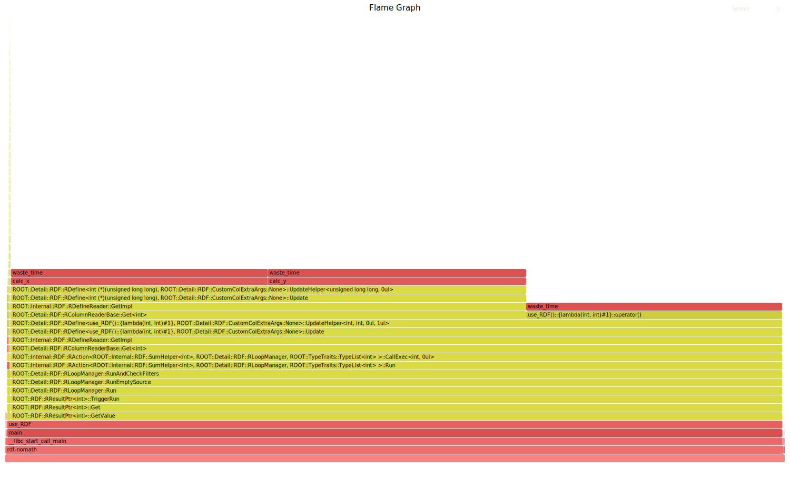
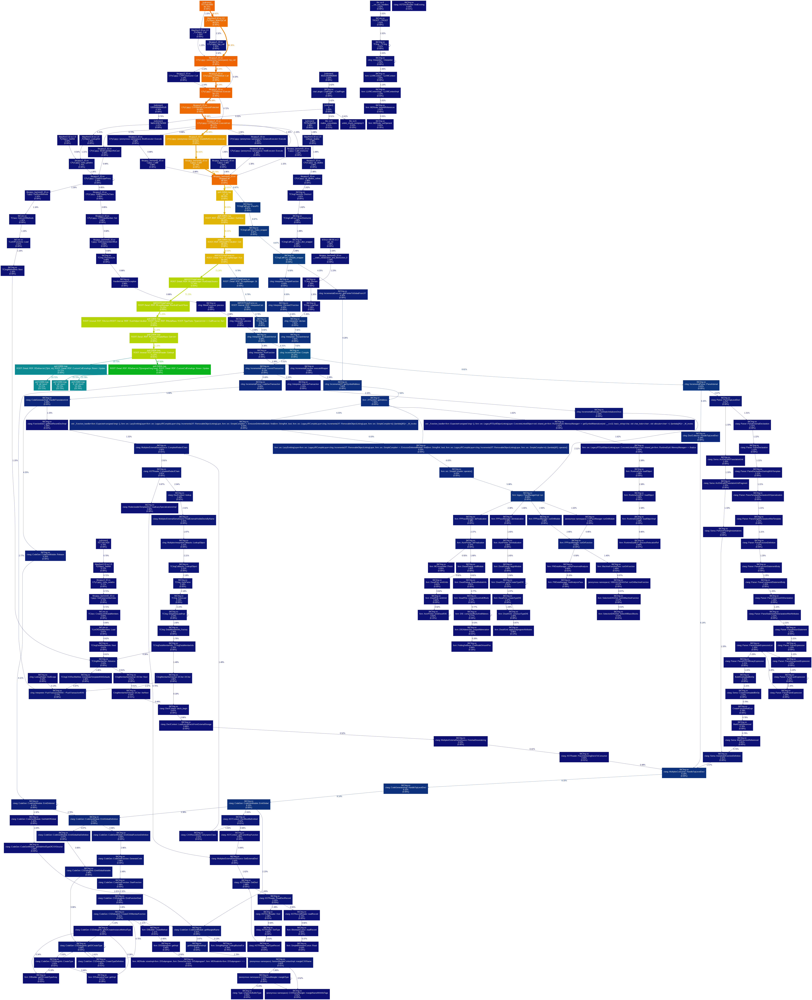
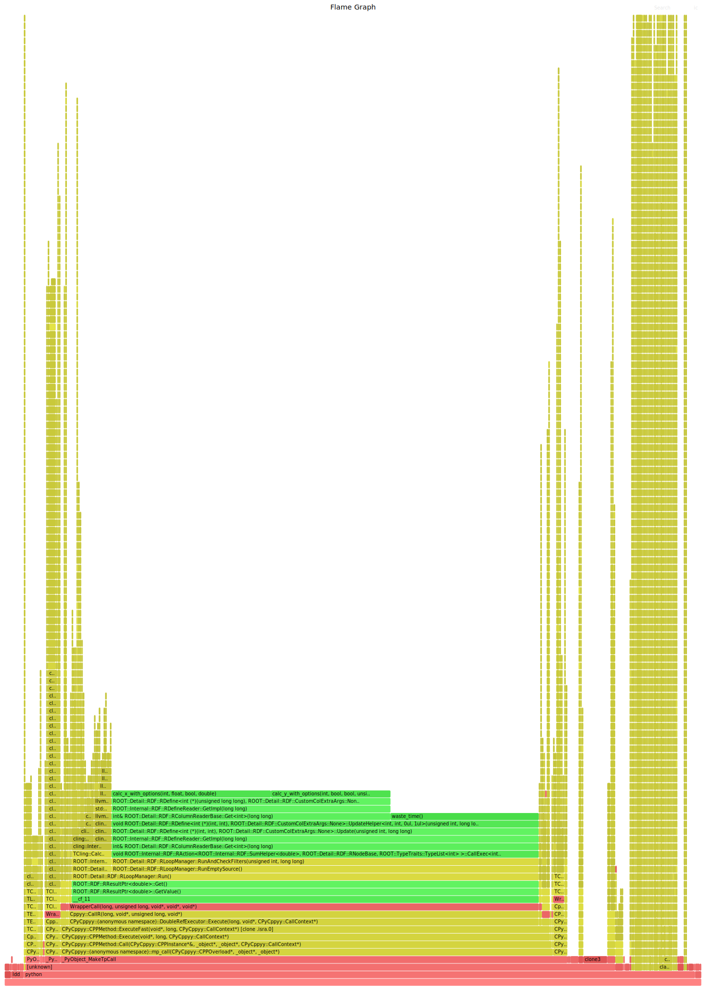

# Profiling RDataFrame with jitted code

This document contains a brief description of the main visualization tools used and guide to reproduce profiles shown in the example section.

The results described here were obtained using **Fedora Linux 36 (Workstation Edition)**, and more specifically using the following tools:

| Tool                  | Version                                |
|-----------------------|----------------------------------------|
| Perf                  | 5.18.9-200.fc36.x86_64 (same as kernel)|
| GCC compiler          | 12.1.1 20220507 (Red Hat 12.1.1-1)     |
| python                | 3.10.5                                 |
| ROOT                  | 6.27/01                                |

More detailed information about software requirements can be found below.

## Visualizations used

Raw data produced by `perf record` can be analyzed in detail using the `perf report` tool. However, using data visualizations is key in profiling since they efficiently convey most of the information in more direct and readable way.

The tools used here are:

* **Flame graph**
    Flame graphs are very popular visualization tools that display call stacks as box stacks whose width is proportional to the time spent in the respective function (more precisely, the width of each box represents the *fraction of samples* collected for the respective function). A detailed description can be found in the original [github repository](https://github.com/brendangregg/FlameGraph "FlameGraph repo") and [website](http://www.brendangregg.com/flamegraphs.html "Main website") by Brendan Gregg.
    
* **Graph representation**
    Graph representations also displays function calls as boxes, but connects them in a (possibly cyclic) graph to convey the information of the call flow. This representation is more compact but can be harder to read. A detailed description can be found in the original [github repository](https://github.com/jrfonseca/gprof2dot "gprof2dot repo") by Jose Fonseca.

**Note:** Neither of the two representation give information about the *order of execution in time* of functions, but rather condense equal call stacks into the same square, thus giving an idea of the overall time spent in each call stack.

## Software requirements

In this section a detailed guide on how the required software was built/installed is given for reproducibility. 

### Building ROOT

The ROOT package has been built from source directly from the ROOT project [github repository](https://github.com/root-project/root "ROOT github repository") latest commit (as of 01/07/22) enabling debug information. ROOT version obtained is reported below: 

```
$ root --version
ROOT Version: 6.27/01
Built for linuxx8664gcc on Jul 01 2022, 13:57:00
From heads/master@v6-25-02-1702-g2e4d86485b
```

#### From source to executable (build detail)

First the [root repo](https://github.com/root-project/root "ROOT github repository") has been cloned to a local copy in `root_src`:

```
$ git clone https://github.com/root-project/root.git root_src
```

To build ROOT, the python script `build-root.py` has been used using the `cling-profile` mode.

```
$ python build-root.py --mode cling-profile
```

The above command builds ROOT providing specific debug options to `cmake` as specified in the `build_opt` dictionary. The precise call performed by the script is:

```
$ cmake  -DCMAKE_BUILD_TYPE="RelWithDebInfo" -DCMAKE_CXX_FLAGS_RELWITHDEBINFO="-O2 -g -fno-omit-frame-pointer" -DCMAKE_INSTALL_PREFIX="/your/path/rootinstall/master-cling-profile" -DLLVM_BUILD_TYPE="RelWithDebInfo" -Dccache="ON" /your/path/root_src
```

In order for `perf` to be able to reconstruct call stacks, it is key to include the `-g -fno-omit-frame-pointer` flags at this stage. 

### Additional requirements

Additionally to ROOT, debug packages have been installed for `python` and `glibc`, using:

```
$ sudo dnf install python-debug
$ sudo dnf install glibc-debug
```

As well as 
```
$ sudo dnf debuginfo-install python
$ sudo dnf debuginfo-install glibc
```

**Note:** It's not completely clear whether these are necessary, and are included for completeness.

Other software used, such as `flamegraph.pl`, `stackcollapse.pl` and `gprof2dot.py` is included in the `tools` directory. 
Finally, in order to produce the graph visualization, the package `graphviz` is necessary as well.

### Perf settings

When profiling with perf, it might be useful to adjust the "paranoid level", in order to gain access to performance monitoring utils normally allowed only as superuser.

In particular, I used:

```
$ sudo sysctl kernel.perf_event_paranoid=-1
$ sudo sysctl kernel.kptr_restrict=0
$ sudo sysctl kernel.nmi_watchdog=0
```

Depending on the application, this might be necessary to collect perf data in the first place.

### Profiling RDataFrame

To run the profiling, two scripts are provided in the `tools directory`:

* `compile.sh`: This is used to compile C++ code, and includes the necessary g++ flags
  Usage:
  ```
  $ /path/tools/compile.sh /name/of/source.cpp
  ```

* `run-profile-fp.sh`: This is used to produce raw perf data and process it to get the final plots. Data is recorded at a relatively high frequency (i.e. 1000 Hz), using the frame pointer option to reconstruct call stacks. (Here fp is preferred over DWARF because of memory efficiency).
  Usage:
  ```
  $ /path/tools/run-profile-fp.sh [COMMAND]
  ```

## Examples

Here some examples of how these tools are used are reported. Two main examples are given to show differences between compiled/jitted code profiles, and efficient/inefficient user defined functions:

* **Toy example:** sum of different RDF columns of the same type. 
    This shows how expensive compiled and jitted functions appear in simplest possible scenario. This includes C++ and Python versions of the same task.
    
* **Realistc exaple:** W boson mass analysis from ATLAS opendata.
    This shows how and when jitted/user-defined functions appear in a more realistic case. This is a Python script (tutorial df105_WBosonAnalysis.py)
    

### Toy example (simple summation)

Here a simple RDataFrame is created and two colums ("x" and "y") are filled with the row number casted to `int`. Element-wise summation of "x" and "y" is performed to a new column "z", which itself is summed at the end.

#### Compiled code

C++ version of the code is included in the `C++/Double-define/` folder. Expensive calculations are simulated by a long `for` loop contained in a `waste_time()` function, called at each calculation.

```c++
int waste_time(void)
{
    int s = 0;
	for (int i = 0; i < LOOP_REPS; ++i){s += i;}
	return s;
}
```

The flamegraphs look as expected:


Timing: 23.49user 0.06system 0:23.62elapsed 99%CPU

Each call to user-defined functions is clearly visible, both declared functions and lambdas.

The graph also looks fine, but the somewhat recursive nature of the code produced a *cyclic* graph, which is harder to undersand in terms of acutal time spent in each function.


#### Jitted code

Python version of the code is included in the `Python/Double-define/` folder. When using jitted code, the enviroment variable `CLING_PROFILE=1` must always be set, as done by the scripts. 
As above, time is wasted by means of `for` loops:

```python
loop = f"int volatile s = 0; for (int i = 0; i < {LOOP_REPS}; ++i){{s += i;}}"

# Spaces are included to make the two strings different, and obtain two different jitted functions.
# If the strings match, the same function will appear in the flame graph
to_be_jitted_calc_x = f" {loop}; return (int)rdfentry_;"
to_be_jitted_calc_y = f"{loop}; return (int)rdfentry_; "

to_be_jitted_sum = f"{loop}; return x+y;"
```

The flamegraph looks very similar to the above. All the jitted function names are visible as `R_rdf::func#`:


Timing: 37.73user 0.46system 0:38.37elapsed 99%CPU

The graph is much more crowded because of the jitting, but the most of samples still lie in a structure similar as before.



### Realistic example (W boson analysis)

Here a much more complex calculation is performed, following RDataFrame tutorial. In particular, the python code used is derived from the [tutorial df105](https://root.cern.ch/doc/master/df105__WBosonAnalysis_8py.html "W boson tutorial page"), omitting the making of graphs.

The two version used here are the original one and a "broken" one, where user defined functions are highlighted by wasting time within their execution.

#### The original example

The original example (code in `Python/Realistic/Original/`) results in this flamegraph:


Timing: 24.16user 0.95system 0:31.10elapsed 80%CPU

Execution time in the event loops is very small if compared to jitting and other non user-dependent operations. This makes the jitted functions hard to spot.

(The other representation is too complex, so is omitted here)

#### A more expensive version

By making the calculation more expensive (code in `Python/Realistic/Broken/`), we can get a much nicer picture:


Timing: 37.95user 0.99system 0:43.35elapsed 89%CPU

Here both nameless functions (i.e. `R_rdf::func#`) and named functions declared to the interpreter (e.g. `GoodElectronOrMuon`) are visible in the graph. This was again obtained by adding expensive loops *within* their definition, rather than by calling some external function.

### General observations

Some general observations about the results obtained so far:

1. Names of jitted functions (e.g. `R_rdf::func0`) only appear when their workload is significant. If not, the call stack "skips" them.
As an example, in `Python/Double-define-explicit-wt/`, the time-wasting loop is defined in a separate function, `waste_time()`, declared to the     interpreter, while the actual calculation is performed in the return statement.

    

    As we can see, `R_rdf::func#` names no longer appear, and both "calc_x" and "calc_y" are collapsed in a single call stack.
    Is this related to **inlining of simple functions** like this one?

2. Call stacks seem to break when external library functions are called, e.g. mathematical libraries from glibc. This happens both to compiled and jitted code. As an example, in `C++/STD-Math/`, the code is calling `std::sin`:

    

    Here the mathematical tools from `libm.so` appear beside `calc_x`, instead that on top.
    The last trustworthy square is the `RDefine`, templated with the correct signature of `calc_x`.

3. Jitted functions declared to the interpreter are wrapped by a c++ lambda. Even if, as in *1.*, the symbol for such wrapper is lost, the signature on the templates remains the one of the wrapper.

    **Example:** In `Python/Realistic/Double-define-explicit-wt-signatures/rdf-nomath.py`, the functions `calc_x_with_options` and `calc_y_with_options` have been declared to the interpreter, but are still wrapped before being called. When called, if we fix one or more of the paramenters to constants, the wrapper will drop the respective input, and the two signatures will be different. In the templates then, we always see the *signature of the wrapper*, which in general can be different than the user-defined function.
    
    
    
